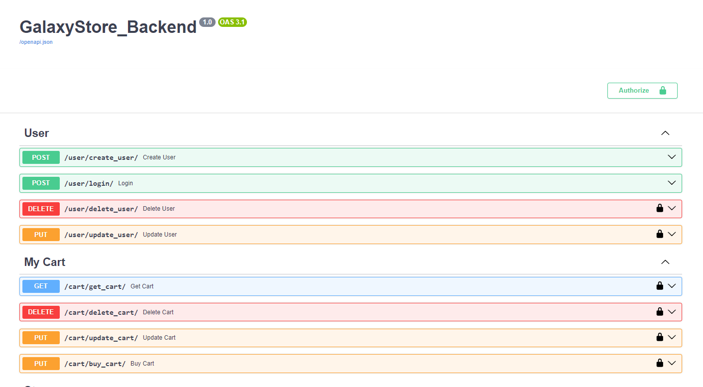
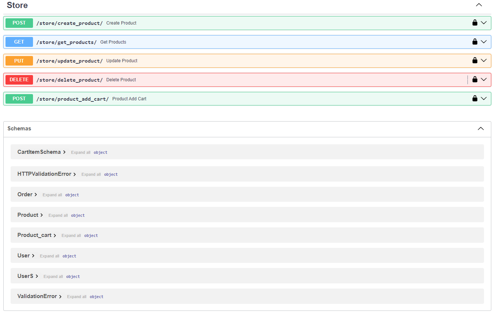

# Galaxystore - Backend

Este es el backend para Galaxystore, una tienda en línea de productos de Star Wars.

## Descripción

Galaxystore es una tienda en línea especializada en productos inspirados en el universo de Star Wars. Este proyecto backend proporciona una API para gestionar usuarios, productos, carritos de compras y compras.




## Tecnologías Utilizadas

- FastAPI: Un framework web moderno y rápido para Python.
- SQLAlchemy: Una herramienta de mapeo objeto-relacional (ORM) para trabajar con bases de datos en Python.
- Pydantic: Una librería para la validación de datos en Python.
- SQLite: Un motor de base de datos relacional ligero.

## Configuración del Entorno

1. Clona este repositorio:

```bash
git clone https://github.com/tu_usuario/galaxystore_backend.git
```

2. Crea un entorno virtual:

```bash
cd galaxystore_backend
python -m venv venv
```

3. Activa el entorno virtual:

```bash
# En Windows
venv\Scripts\activate

# En macOS/Linux
source venv/bin/activate
```

4. Instala las dependencias:

```bash
pip install -r requirements.txt
```

## Configuración de la Base de Datos

El proyecto utiliza SQLite como base de datos. La base de datos se encuentra en el archivo `database.sqlite`.

Para añadir o actualizar los productos en la Base de datos debes loguearte como:
- Usuario: *admin*
- Contraseña: *admin123*
## Ejecución del Servidor

Para ejecutar el servidor de desarrollo, utiliza el siguiente comando:

```bash
cd backend
uvicorn app.main:app --reload
```


- El servidor estará disponible en `http://localhost:8000`.

## Endpoints Disponibles

- `/users/`: Gestiona los usuarios de la tienda.
- `/products/`: Gestiona los productos disponibles en la tienda.
- `/cart/`: Gestiona el carrito de compras de los usuarios y realiza compras.


Consulta la documentación de la API para obtener más detalles sobre los endpoints y sus parámetros.

## Contribuciones

Las contribuciones son bienvenidas. Si encuentras algún problema o deseas mejorar el proyecto, ¡no dudes en abrir un issue o enviar un pull request!
